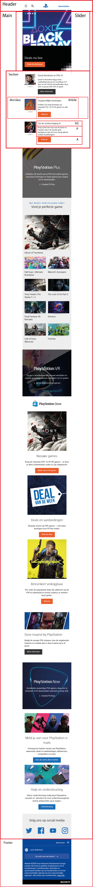

<html>
<body>
  
  
  

<h2>Voortgang 1 (week 3):</h2>

Stand van zaken

Ik vond het erg lastig omdat het best nog wel wennen was met dat flexbox om goede posities aantegeven van waar de flexbox moest staan en hoe dit echt goed in zijn werking ging. Daarbij vond ik het lastig om in het menu het logo te krijgen. En heb ik nog beter onderzocht en waar ik het kon toepassen als je een p + p bijvoorbeel doet in je css.

Vond het super leuk om te doen alleen zat al wel veel tijd in dat is waarom ik nog niet zo ver ben na mijn mening. En omdat bij anderen vakken ook allemaal deadlines waren deze week heb ik er wat minder tijd voor gehad.

<h1>Breakdown schets:</h1>

</body>
</html>
